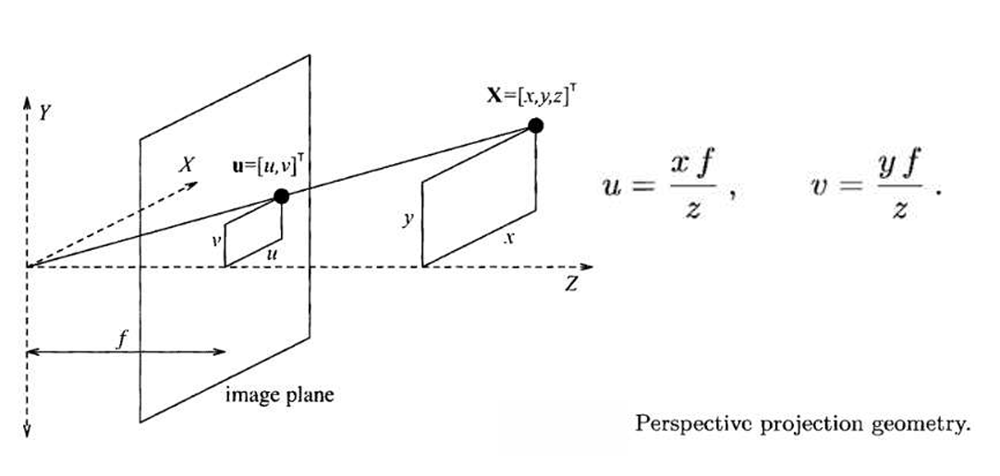

# Khoa học dữ liệu thị giác là gì?

# Cách mạng công nghiệp 4.0 là gì?

# Giải thích "Thông minh hoá **qui trình sản xuất** và **quản lý xã hội** trên thế giới ở diện rộng với **nền tảng chuyển đổi số**, trong đó **AI** giữ vai trò cốt lõi
* Thông minh hoá:
* Qui trình sản xuất và quản lý xã hội: Xã hội cần sản xuất vật chất nên...
* Diện rộng: tránh độc quyền, quá lớn mạnh, các nước lân cận không có khả năng mua của nước mạnh
* Chuyển đổi số: số hoá + thay đổi quy trình hoạt động
* AI:
* Tổng thể:

# Các ví dụ về chuyển đổi số
* Ví điện tử:
* Thủ tục hành chính:
* Dịch vụ xe taxi:
* Thương mại điện tử:
* Marketing:
* Giáo dục:

# Bốn cuộc cách mạng công nghiệp
* Cách mạng công nghiệp 1.0: Cơ khí hoá
    * 
* Cách mạng công nghiệp 2.0: Điện khí hoá - Tự động hoá
    * 
* Cách mạng công nghiệp 3.0: Số hoá
    * 
* Cách mạng công nghiệp 4.0: Chuyển đổi số
    * 

# Khác biệt giữa mắt người và camera:
* Mắt người gắn liền với não | Camera chỉ tiếp nhận hình ảnh
* Cách thu nhận hình ảnh: Khả năng tự hiệu chỉnh: Trong bóng tối, mắt thấy rõ dần (do não) | camera thì không
* Lưu trữ: Mắt kém hơn | Camera tốt hơn
* Có lưu giữ thông tin 3 chiều không:

# Các đặc trưng khi tiếp nhận một bức ảnh
* Đặc trưng thị giác: màu, vật, dáng
* Đặc trưng ngữ nghĩa: đối tượng (đặc thù, tổng quát, trừu tượng), cảnh, sự kiện

# Thách thức lớn nhất của Khoa học dữ liệu thị giác
* Khoảng cách ngữ nghĩa (Semantic Gap)

# Đột phá khi giải quyết được Semantic Gap

# Hiện nay, Khoa học dữ liệu thị giác đã giải quyết Semantic Gap như thế nào?

# Các ví dụ cần đến lĩnh vực
* Computer Graphics - Đồ hoạ máy tính:
    * 
* Image Processing - Xử lý ảnh:
    * 
* Computer Vision - Thị giác máy tính:
    * 

# Phân biệt 3 lĩnh vực Computer Graphics, Image Processing, Computer Vision (Bảng: Mục đích, input, output)

# Detect Bounding Box cho người, vật để làm gì?

# Thế nào là **thông minh**
* Thông minh là biết thích ứng với môi trường (sự thay đổi)

# Phân biệt trí tuệ nhân tạo và trí tuệ tự nhiên (Bảng: cơ chế, năng lượng, bộ nhớ, khả năng sáng tạo)
* TTNT do con người lập trình tạo nên, có thể suy luận, tự học, giao tiếp với con người
# Con người nghĩ ra Trí tuệ nhân tạo thì sáng tạo ở điểm nào
* Phần cứng:
* Thuật toán:
* Ý tưởng:
* Số hoá những dữ liệu có sẵn:
# Khuyết điểm của Trí tuệ nhân tạo so với con người trong việc sáng tạo
* Con người tận dụng được tiềm năng của tự nhiên, vd: tìm ra điện
* Trí tuệ nhân tạo chỉ biết cách liên kết những thứ đã tồn tại
# Trí tuệ nhân tạo có gì đặc biệt so với trí tuệ con người
* Trí tuệ nhân tạo lưu trữ dài hạn, có "kinh nghiệm"
# Trí tuệ tự nhiên kém điểm nào
* Xử lý dữ liệu lớn

# Giải thích câu nói "I’m intrigued that AI has by now succeeded in doing essentially everything that requires “thinking” but has failed to do most of what people and animals do “without thinking”" của Donald Knuth

# Các sáng tạo thực sự của con người mà không có sự ảnh hưởng của những thứ sẵn có trong tự nhiên

# Giải thích câu nói "Intalligence is the ability to adapt to change" - Stephen Hawking
* Phải có kiến thức, khả năng tự học, ứng dụng kiến thức ra môi trường hiệu quả

# Học máy là gì? Học máy có gì khác với học thông thường?
* Học máy là học từ dữ liệu
* Học máy: Input + output -> Rule
* Học thông thường: Input + rule -> output, khi áp dụng cho bài toán khác thì cần thiết kết lại rule
* Cách inference ví dụ mới

# Ví dụ cho việc càng sử dụng mô hình, mô hình càng cải thiện
* Sử dụng mô hình, kiểm thử dữ liệu, cung cấp thêm dữ liệu, mô hình thay đổi trọng số, hệ thống tốt hơn

# Học sâu là gì?
* Học máy ở nhiều cấp độ và nhiều mức trừu tượng

# Vì sao xảy ra hiện tượng blackbox nhưng con người vẫn tin tưởng vào output

# Huấn luyện ChatGPT đã sử dụng bao nhiêu GPU (loại nào)

# Reinforce Learning được ứng dụng nhiều ở đâu
* Cờ vây, cờ vua

# Ví dụ về **tìm** và **kiếm**
* Tìm: có sẵn, đi tìm
* Kiếm: không có nhưng muốn có
* Tracking: detect = tìm + follow = kiếm
* Kiếm tiền?

# Ví dụ cho output của hệ thống thị giác theo 5 cấp độ - Mức độ thông mình của đầu ra của hệ thống thị giác

|   Tác vụ          |     Input             |   Output              |   Level           |
|   ---             |     ---               |   ---                 |   ---             |
| Classification    |   Ảnh                 |   Ảnh được chuẩn hoá  |   Data            |
|                   |   Ảnh được chuẩn hoá  |   Feature map         |   Information     |
|                   |   Feature map         |   Nhãn                |   Knowledge       |
| Image2Text        |   Ảnh                 |   Nội dung            |   Intelligence    |
| Image reader      |   Ảnh                 |   Âm thanh            |   Wisdom          |

# Tên các phần mềm đồ hoạ liên quan đến
* Officec Automation: Word, Office, Excel, PP
* Desktop Publishing: Auto outline, Adobe Design, Adobe Illustrator
* CAD - CAM: Autodesk, Auto CAD, VietCAD, Master CAM, Pro Engineer, Cimatron
* Advertising: Corel Draw, Adobe Illlustrator
* Process Control: Simulation
* Entertainment: Blender
* Education: Portal for Edu, Geogebra

# Vì sao phải mua license thay vì crack

# Vì sao con người nhìn được nhiều màu

# Vì sao trong in ấn sử dụng CMYK nhưng màn hình lại sử dụng RGB
* Ánh sáng phản xạ và ánh sáng chiếu trực tiếp

# Trình bày cách tính toạ độ chiếu (u, v) dựa vào toạ độ thực (x, y, z) và tiêu cự f (khoảng cách tâm chiếu)

# Giải thích, cho ví dụ về H, S, V trong hệ màu HSV

# Trong thế giới có bao nhiêu đối tượng 2D, 3D

# Thực thể cơ bản trong 3D là gì
* Wireframe, mesh

# Vì sao màn hình nhỏ có thể mô phỏng thế giới thực
* Các phép biến đổi thực thể hình học: phóng to, thu nhỏ, view to win, win to view, chiếu song song, chiếu phối cảnh

# Trong công thức vẽ đoạn thẳng $p_0 = 2 \Delta y - \Delta x$, $\Delta x$, $\Delta y$ là gì
* $\Delta x = x_B - x_A$
* $\Delta y = y_B - y_A$

# Giải thích (khuyết điểm) giải thuật DDA của vẽ đoạn thẳng
* Do vướng số float -> yếu hơn Bresenham

# Viết giải thuật Bresenham với m tuỳ ý

# Tính $p_0$ trong công thức quy nạp vẽ đoạn thẳng

# Nguyên lý vẽ đoạn thẳng

# Bài tập: Vẽ đoạn thẳng qua A(20; 10), B(30; 18)
1. Khởi động các tham số\
$\Delta x = 10 $\
$\Delta y = 8 $\
$p_0 = 2 \Delta y - \Delta x = 6$\
$2 \Delta y = 16$\
$2 \Delta y - 2 \Delta x = -4$\
$(x_0, y_0) = (20; 10)$
2. Lập bảng tính $(x_k, y_k)$

| $k$ | $p_k$   | $(x_{k+1}, y_{k+1})$ |
| --- | ---     | ---                  |
| 0   | 6       | (21; 11)             |
| 1   | 2       | (22; 12)             |
| 2   | -2      | (23; 12)             |
| 3   | 14      | (24; 13)             |
| 4   | 10      | (25; 14)             |
| 5   | 6       | (26; 15)             |
| 6   | 2       | (27; 16)             |
| 7   | -2      | (28; 16)             |
| 8   | 14      | (29; 17)             |
| 9   | 10      | (30; 18)             |

Vẽ màn hình

# Chứng minh trong góc 1/8, |hệ số góc tiếp tuyến| < 1
$x^2 + y^2 = R^2$\
$\implies 2xdx + 2ydy = 0$\
$<=> ydy = -xdx$\
$\frac{dy}{dx} = \frac{-x}{y}$\
Với $x < y$ trong góc 1/8
$\implies |\frac{dy}{dx}| \le 1$

# Chứng minh: nếu điểm giữa thuộc miền trong chọn $y_k$ (<=> $p_k < 0$), nếu điểm giữa thuộc miền ngoài -> chọn $y_k - 1$ (<=> $p_k > 0$)

# Tính $p_0$ trong công thức quy nạp đường tròn
$p_0 = f_{circle}(1; r - \frac{1}{2}) = 1 + (r - \frac{1}{2})^2 - r^2 = \frac{5}{4} - r$

# Chứng minh với r nguyên, có thể dùng $p_0' = p_0 - \frac{1}{4}$ mà các công thức vẫn đúng
(Chứng minh $p_0 > 0 -> p_o' > 0$ và $p_0 < 0 -> p_o' < 0$)

# Bài tập: Vẽ đường tròn tâm O(0; 0), bán kính r = 10
1. Khởi động các tham số\
$p_0 = \frac{5}{4} - r = \frac{-35}{4}$\
$p_0' = 1 - r = -9$\
$2x_0=0$\
$2y_0=20$\
$(x_0, y_0) = (0; 10)$
2. Lập bảng tính $(x_k, y_k)$

| $k$ | $p_k'$ | $2 x_{k + 1}$ | $2 y_{k + 1}$ | $(x_{k + 1}, y_{k + 1})$ |
| --- | --- | --- | --- | --- |
| 0 | -9 | 0 | 20 | (1; 10) |
| 1 | -6 | 2 | 20 | (2; 10) |
| 2 | -1 | 4 | 20 | (3; 10) |
| 3 | 6 | 6 | 20 | (4; 9) |
| 4 | -3 | 8 | 18 | (5; 9) |
| 5 | -8 | 10 | 18 | (6; 8) |
| 6 | 5 | 12 | 16 | (7; 7) |

SAI

Vẽ màn hình

# Giải thích ý nghĩa góc $\varphi$ trong phương trình ellipse trong hệ toạ độ cực

# Bài tập: Vẽ ellipse tâm O(0; 0), $r_x = 8$, $r_y = 6$
1. Khởi tạo các tham số giai đoạn 1\
$2r_y^2x_0 = 0; 2r_y^2 = 72; r_y^2 = 36$\
$2r_x^2y_0 = 768; 2r_x^2 = 128$\
$p1_0 = r_x^2 - r_x^2r_y + \frac{1}{4}r_x^2 = -332$\
$(x_0, y_0) = (0; 6)$
2. Lập bảng tính $(x_k, y_k)$ giai đoạn 1

| $k$ | $p1_k$ | $(x_{k + 1}, y_{k + 1})$ | $2 r_y^2 x_{k + 1}$ | $2 r_x^2 y_{k + 1}$ |
| --- | ---    | ---                      | ---                 | ---                 |
| 0   | -332   | (1; 6)                   | 72                  | 768                 |
| 1   | -224   | (2; 6)                   | 144                 | 768                 |
| 2   | -44    | (3; 6)                   | 216                 | 768                 |
| 3   | 208    | (4; 5)                   | 288                 | 640                 |
| 4   | -108   | (5; 5)                   | 360                 | 640                 |
| 5   | 288    | (6; 4)                   | 432                 | 512                 |
| 6   | 244    | (7; 3)                   | 504                 | 384                 |

Dừng vì $2r_y^2x_7 > 2r_x^2y_7 (72*7 > 128*3)$

3. Khởi tạo tham số giai đoạn 2\
$x_{last}:=7; y_{last}:=3$\
$2r_x^2y_{last} = 384; 2r_x^2 = 128; r_x^2=64$\
$2r_y^2x_{last} = 504; 2r_y^2 = 72$\
$p2_0 = r_y^2(x_{last}+\frac{1}{2})^2 + r_x^2(y_{last}-1)^2 - r_x^2r_y^2 = -23$

4. Lập bảng tính $(x_k, y_k)$ giai đoạn 2

| $k$ | $p2_k$ | $(x_{k + 1}, y_{k + 1})$ | $2 r_x^2 y_{k + 1}$ | $2 r_y^2 x_{k + 1}$ |
| --- | ---    | ---                      | ---                 | ---                 |
| 0   | -23    | (8; 2)                   | 256                 | 576                 |
| 1   | 361    | (8; 1)                   | 128                 | 576                 |
| 2   | 297    | (8; 0)                   | 0                   | 576                 |

Dừng thuật toán

Vẽ màn hình

# So sánh cách vẽ đoạn thẳng, đường tròn, ellipse (bảng)
* Hệ số góc tiếp tuyến chi phối cách vẽ

# Chứng minh: Đường cong Bezier đi qua 2 điểm đầu mút
Với đường cong Bezier bậc 3, ta có:\
$P(u) = \Sigma_{k=0}^{3} p_k BEZ_{k, 3}(u) \quad (0 \le u \le 1)$\
$BEZ_{0, 3}(u) = (1-u)^3$\
$BEZ_{1, 3}(u) = 3u(1-u)^2$\
$BEZ_{2, 3}(u) = 3u^2(1-u)$\
$BEZ_{3, 3}(u) = u^3$\
$P(u) = p_0 (1-u)^3 + 3p_1 u(1-u)^2 + 3p_2 u^2(1-u) + p_3 u^3 \quad (0 \le u \le 1)$

$u = 0 \implies P(0) = p_0$\
$u = 1 \implies P(1) = p_3$

Vậy đường cong Bezier đi qua 2 điểm đầu mút

# Chứng minh: Đường cong Bezier tiếp xúc với 2 đoạn điều khiển tại 2 đầu mút
Với đường cong Bezier bậc 3, ta có:\
$P(u) = \Sigma_{k=0}^{3} p_k BEZ_{k, 3}(u) \quad (0 \le u \le 1)$\
$P'(u) = -3p_0 (1-u)^2 + 3p_1 [(1-u)^2 -2u(1-u)] + 3p_2[2u(1-u) - u^2] + 3p_3u^2$\
$P'(u) = -3p_0 (1-u)^2 + 3p_1 (1-u)^2 - 6p_1u(1-u) + 6p_2u(1-u) - 3p_2u^2 + 3p_3u^2$\
$P'(0) = -3p_0 + 3p_1 = 3(p_1 - p_0)$\
$P'(1) = -3p_2 + 3p_3 = 3(p_3 - p_2)$

Vậy đường cong Bezier bậc 3 tiếp xúc với 2 đoạn điều khiển tại 2 đầu mút

# Tính đạo hàm bậc 2
$P''(u) = 6p_0 (1-u) - 6p_1 (1-u) -6p_1 (1-2u) + 6p_2 (1-2u) - 6p_2u + 6p_3u$

# Nếu có các tính chất như thế thì có lợi gì
* Thiết kế UI vẽ tiện lợi hơn

# So sánh đường cong Spline Hermite với đường cong Bezier bậc 3

# Sau khi thay đổi 1 trong các điểm điều khiển thì đường cong bị sửa đổi toàn cục hay cục bộ? Vì sao?
* Lý thuyết: Đường cong bị sửa đổi toàn cục vì $P(u) = \Sigma_{k=0}^{3} p_k BEZ_{k, 3}(u) \quad (0 \le u \le 1)$ nên khi $p_k$ thay đổi thì P(u) thay đổi $\quad (0 \le u \le 1)$
* Ứng dụng: Đường cong bị sửa đổi cục bộ do đường cong Bezier bậc cao được tách thành các đường cong Bezier bậc 3, khi sửa đổi 1 điểm điều khiển $p_k$, chỉ có 1 hoặc 2 đường cong bị sửa đổi

# Làm sao khi thiết kế đường cong có nhiều điểm điều khiển vẫn giữ được đường cong bậc 3 và có tính sửa đổi cục bộ

# Chứng minh tại điểm kết nối đạt $C^0$, $C^1$
* $C^0$ do 2 đường liên tiếp cùng đi qua 1 đầu mút
* $C^1$ do 2 tiếp tuyến thẳng hàng

# Giải thích ý nghĩa của tính chất bất biến affine
* Nghĩa là khi áp dụng các phép biến đổi lên đường cong Bezier thì chỉ cần áp dụng phép biến đổi ấy lên các điểm điều khiển -> các điểm điều khiển vẽ lại đường cong mới

# Bài tập